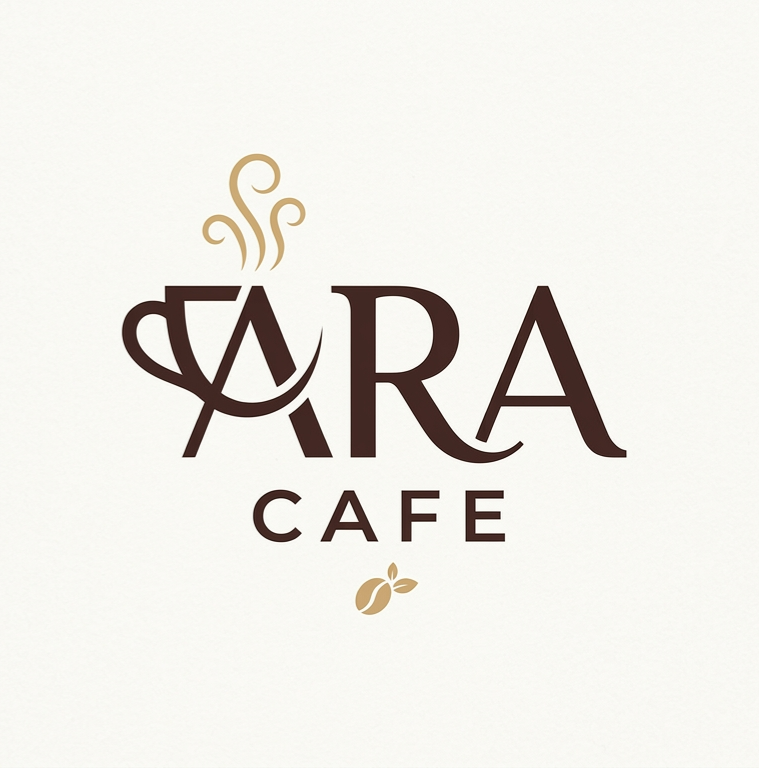

# ☕ کافه آرا | ARA Cafe

  

  <strong>وب‌سایت منوی کافه آرا</strong> 
  نوشیدنی‌های گرم و سرد بر پایه اسپرسو، چای و دمنوش

  

---

## 📋 **درباره پروژه**

وب‌سایت منوی آنلاین **کافه آرا (ARA Cafe)** با طراحی مدرن، واکنش‌گرا و بهینه‌سازی شده برای سئو. این پروژه شامل صفحه اصلی نمایش منو و پنل مدیریت برای افزودن، ویرایش و حذف محصولات می‌باشد.

### ✨ **ویژگی‌ها**

- 🎨 **طراحی مدرن و جذاب** با تم قهوه‌ای و گرم
- 📱 **کاملاً واکنش‌گرا** (موبایل، تبلت، دسکتاپ)
- 🔍 **سئو قوی** با Schema.org و Open Graph
- 🎬 **انیمیشن‌های نرم** و دلنشین
- 🔒 **پنل مدیریت** با احراز هویت
- 📸 **آپلود تصویر** برای محصولات
- 🌐 **فارسی و راست‌چین**
- ⚡ **سرعت بالا** و بهینه

---

## 🚀 **دمو آنلاین**

مشاهده نسخه آنلاین: [aracafe.vercel.app](https://aracafe.vercel.app)

---

## 🛠️ **تکنولوژی‌ها**

| تکنولوژی | توضیح |
|-----------|---------|
| **HTML5** | ساختار صفحات |
| **CSS3** | استایل‌دهی و انیمیشن‌ها |
| **JavaScript** | منطق برنامه (Vanilla JS) |
| **JSON** | ذخیره‌سازی داده‌های منو |
| **localStorage** | ذخیره‌سازی محلی (پنل مدیریت) |
| **Vercel** | میزبانی و deploy |

---

## 📁 **ساختار پروژه**
